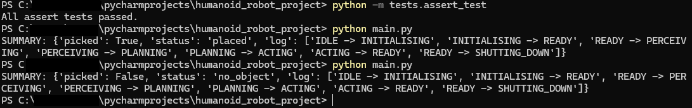

# Humanoid Robot System

## Overview

This project contains a system implementation for a humanoid robot following the UML diagrams created in the Units 1-7. 
The system supports the robot through various processes, it also integrates sensor and actuator modules, these modules are used to demonstrate a task wherein the robot picks up, moves and then places an object.
The implementation directly reflects the UML diagrams from the System Design task: 
Class diagram 
State transition diagram 
Activity diagram
Sequence diagram 

## Project Structure

Humanoid_Robot_Project/  
│ 
+── humanoid_robot/ 
│ +── init.py 
│ +── core/ 
│ │ +── controller.py  
│ │ +── sensors.py  
│ │ +── actuators.py  
│ │ +── state.py  
│ +── activities/  
│ │ +── navigation.py  
│ +─ sequences/  
│ │ +── tasks.py  
│ +── tests/  
│ +── assert_tests.py  
│  
+── main.py # Demo entrypoint  

## Running Tests 

To run a test using assert, enter the following into the terminal:   
python -m tests.assert_test 

To run the demo, enter into the project root:   
python main.py 

Below is an image of the expected output from both: 

This testing ensures valid state transitions, the raising of errors when invalid transitions are attempted and a cycle that returns the robot back to the READY state. 
  

## Reflection on UML diagrams 
The development process for this robot was reliant on the already existing UML diagrams, and effort was put in to ensure it stayed as close to the diagrams as possible.  

Class diagram: This diagram was followed properly, evidenced through the use of 'RobotController' as a class controlling 'Sensor' and 'Actuator' modules.  
State Transition Diagram: this was also followed through the use of 'set_state()' to enforce valid transitions, also the use of logging transitions for traceability.   
Activity Diagram: Also followed, evidenced through the use of 'navigation.perceive_plan_act()' to implement the loop.  
Sequence Diagram: This diagram was followed through the use of 'tasks.pick_and_place()' to control the interaction between sensors, controller and actuators. 
 

## Approach 
The system was approached with an appropriate object-oriented design, modularising the design as necessary (core, sequences etc.). The use of python's 'dataclasses' helped simplify certain parts. 
The project is structured so that adding or removing activities, sequences or components can be done easily without modifying the core. 

## Reflection 
Throughout the development process, import paths and the structure of packages were significant challenges. These were resolved by running all scripts from the project root. 
This decision allowed clean imports, which are good python practices. The testing strategy attempted to maximise clarity with simplicity,
through the use of assert to ensure clear evidence of the test being effective while remaining simple to run. 
  

The code also attempts to reflect the randomness of a real life situation, the sensors and actuators generate simplified and randomised data to represent this. 
This solution works well as it follows the original UML design of being prepared for errors without requiring physical hardware to test the code. 
It also allowed testing multiple paths easily. 
 

Overall the main reflection is that this project demonstrates a successful transition between design and outcome. 
The UML diagrams guided the main points of development, helping ensure clarity of vision to what the final outcome should be. 
The outcome is a working python system that allows the user to test the functions of a humanoid robot, 
the robot's flexibility for further additions/changes is also helpful to the lifecycle of such a robot. 

## Learning Outcomes 
This project has addressed the original learning outcomes, some key examples being:   
The use of previously created UML diagrams to assist in object-oriented design.   
Application and use of data structures. (Dictionaries for sensors/actuators, logs for transitions)   
Implementation of efficient search/decision logic. (Planning based on data gathered through perception)   
Best practices in Python, including PEP-8.   

## References 
While the code is original, various sources were used in the gathering of libraries and methods of coding.   

w3Schools (2024). Python Tuples. [online] www.w3schools.com. Available at: https://www.w3schools.com/python/python_tuples.asp.   

docs.python.org. (n.d.). enum — Support for enumerations — Python 3.10.1 documentation. [online] Available at: https://docs.python.org/3/library/enum.html.   

GeeksforGeeks (2020). Python pass Statement. [online] GeeksforGeeks. Available at: https://www.geeksforgeeks.org/python/python-pass-statement/.   

Python, R. (2025). Python’s assert: Debug and Test Your Code Like a Pro – Real Python. [online] realpython.com. Available at: https://realpython.com/python-assert-statement/.   

Python documentation. (2025). Futures. [online] Available at: https://docs.python.org/3/library/asyncio-future.html.   

Python Software Foundation (2019). typing — Support for type hints — Python 3.8.1rc1 documentation. [online] Python.org. Available at: https://docs.python.org/3/library/typing.html.   

